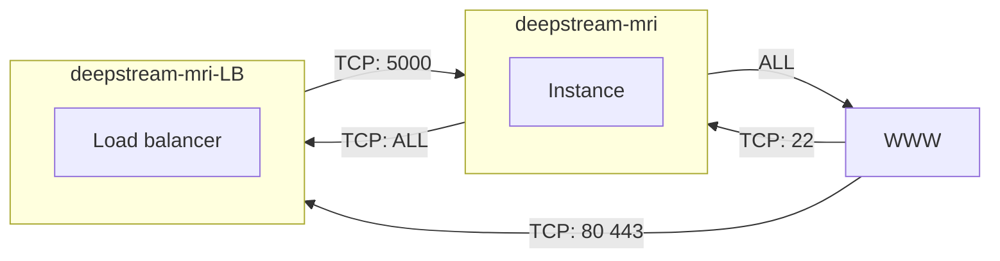
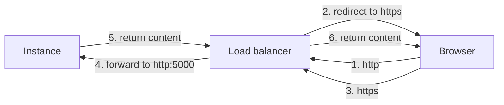

# AWS setting up

## AWS

1. Do not use default security group

    > The default security group for the VPC does not allow incoming SSH traffic by default[^1].

    [^1]: [Set up EC2 Instance Connect](https://docs.aws.amazon.com/AWSEC2/latest/UserGuide/ec2-instance-connect-set-up.html)

1. Verify fingerprint

    ```shell
    sudo ssh-keygen -l -f /etc/ssh/ssh_host_rsa_key -E md5
    ```

## Ubuntu

1. Add user

    ```shell
    sudo adduser yangyanting
    ```

1. Add sudo premission

    Creat file:

    ```shell
    sudo vim /etc/sudoers.d/user
    ```

    Add content:

    ```shell
    yangyanting ALL=(ALL) NOPASSWD:ALL
    ```

1. copy authorized_keys

    ```shell
    su yangyanting
    mkdir .ssh
    sudo cp /home/ubuntu/.ssh/authorized_keys /home/yangyanting/.ssh/
    sudo chown yangyanting:yangyanting /home/yangyanting/.ssh/authorized_keys
    ```

## Record

1. Install Conda
1. Install flask[^2]
1. create `debug.sh`
1. Request SSL in AWS
1. Create Load Balancer
1. Edit GoDaddy DNS settings. Add http forward.

[^2]: [Flask Installation](https://flask.palletsprojects.com/en/2.0.x/installation/)

Security Groups:



Network:



`https://www.deepstream-mri.com`, `http://www.deepstream-mri.com`, `http://deepstream-mri.com` and `deepstream-mri.com` can be accessed correctly. Only `https://deepstream-mri.com` can not be reached correctly. But this kind of url is rarely accessed.
